<h2>Compte Rendu </h2>
<h3>Partie 0</h3>
<h3>Architecture du projet</h3>
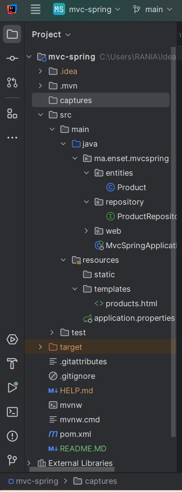
<h3>Class Product</h3>
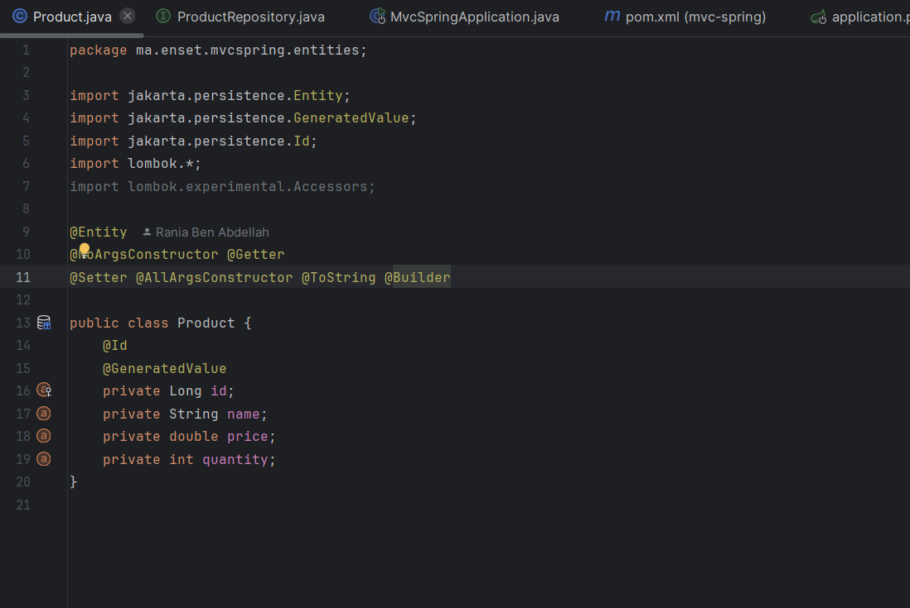
<h3> Interface ProductRepository</h3>
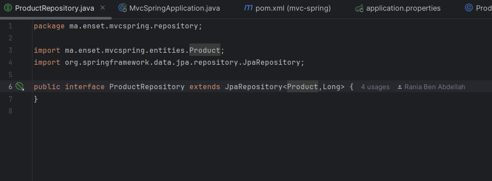
<h3> MvcSpringApplication</h3>
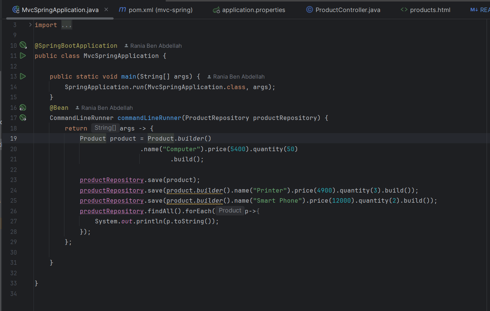
<h3> products.html</h3>
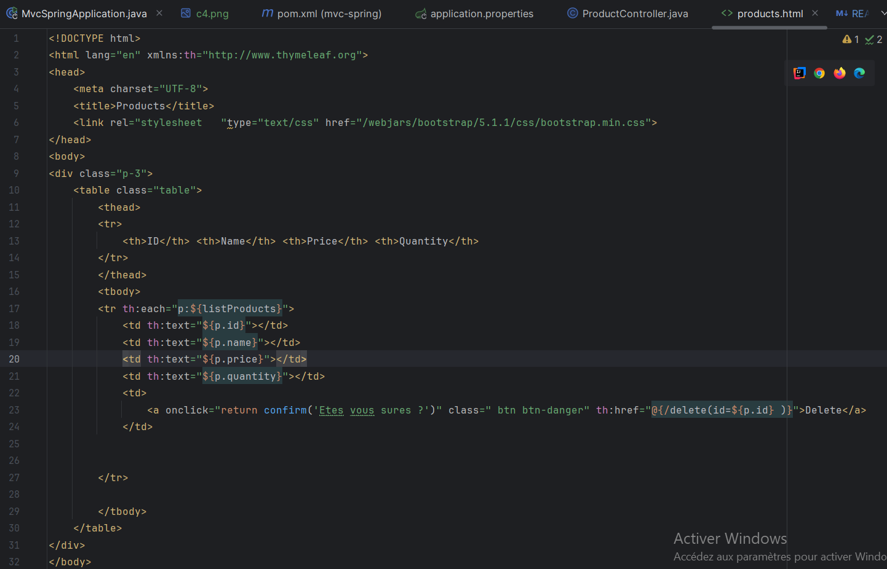
<h3> application.properties</h3>
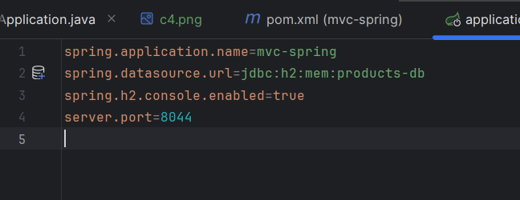
<h3> Base de donnée H2 </h3>
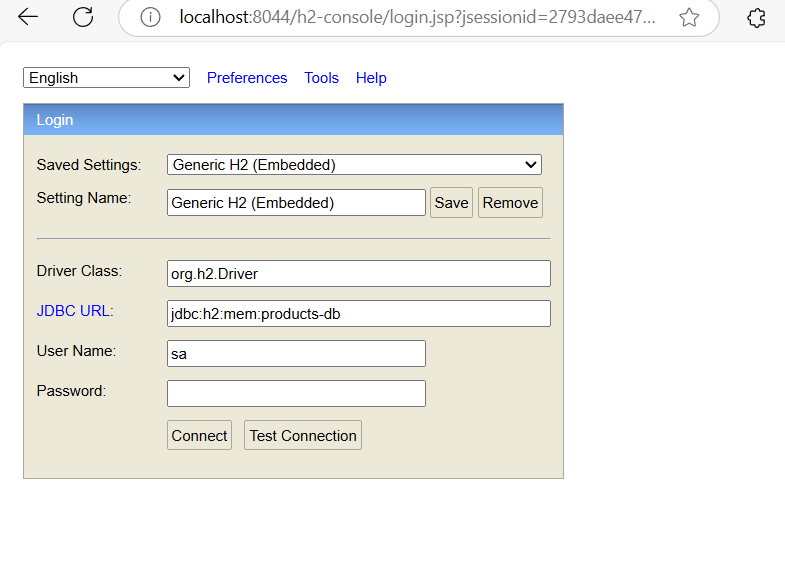
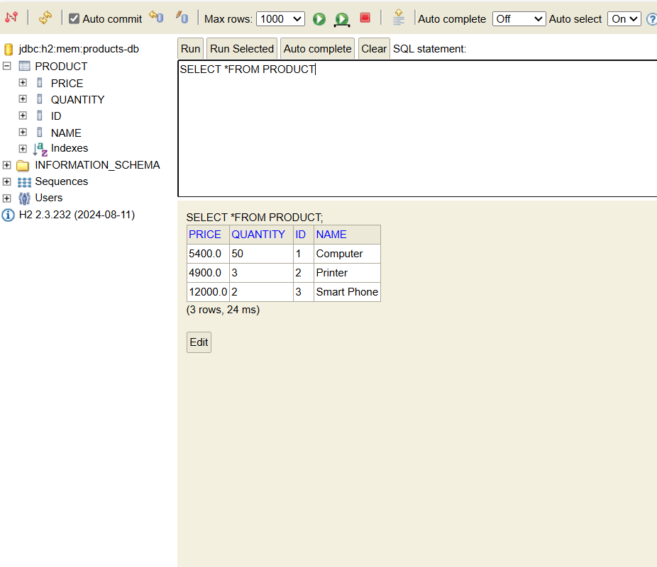
<h3>Rendu HTML généré coté serveur </h3>
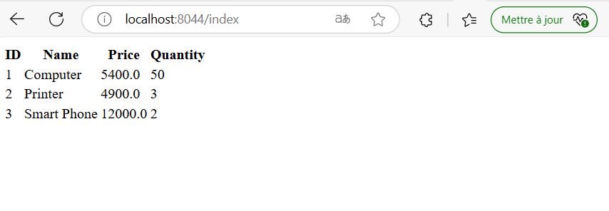
<h3>Rendu HTML généré coté serveur en ajoutant bootstrap </h3>
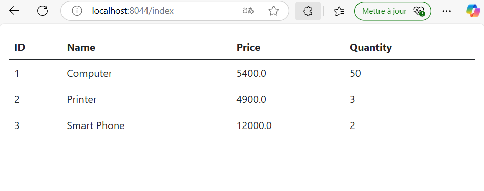
<h3>Rendu HTML généré coté serveur en ajoutant bootstrap et bouton DELETE </h3>
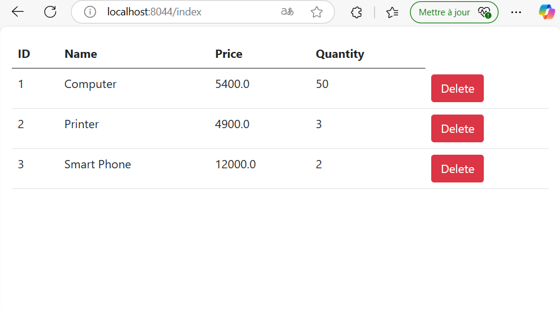
<h3>Rendu HTML généré coté serveur aprés suppression du produit dont l'ID est 3  </h3>
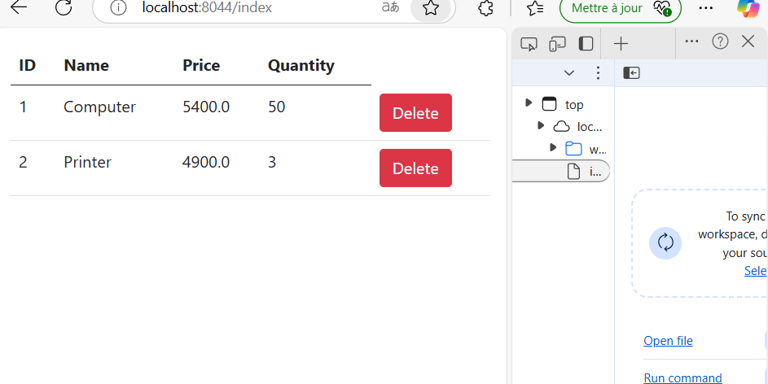
<h3>Rendu HTML généré coté serveur: Affichage d'un message pour confirmer la suppresion</h3>
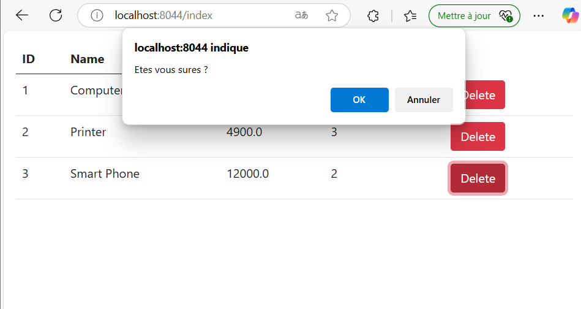

